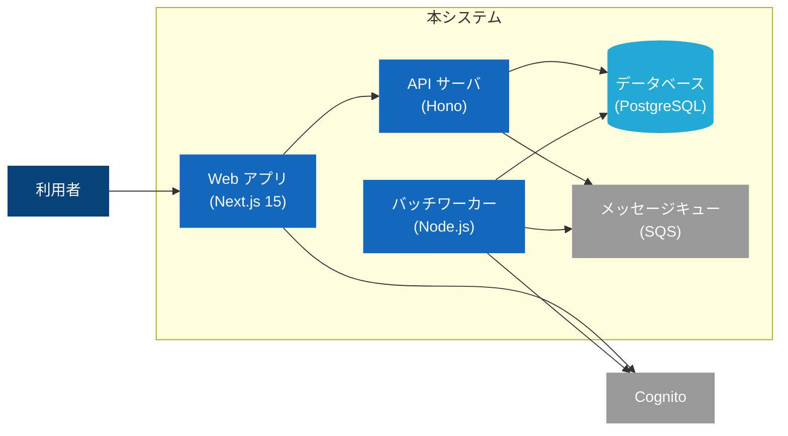

# アーキテクチャ設計（C4 モデル）フォーマット定義

対象: ドキュメントルート配下の `architecture.md`
- ブートストラップで合意済みの場合はそのパス（既定は `basic-design/architecture.md`）
- ディレクトリ構成が未確立の場合は、先に `references/bootstrap.md` を実行すること
- システム名・アクター名・コンポーネント名はユビキタス言語定義に準拠する（未整備なら `references/ubiquitous-language.md` を先に実行）

## C4 モデルの方針

C4 モデル（Context / Container / Component / Code）は 4 段階の抽象度でアーキテクチャを記述する手法。
本スキルでは **Context と Container を必須**、**Component は任意**、**Code は原則書かない**とする。

| レベル | 対象 | 本スキルでの扱い |
|---|---|---|
| L1. Context | システムとユーザー・外部システムの境界 | **必須** — 「誰が何のために使うシステムか」を一枚絵で示す |
| L2. Container | システム内のデプロイ単位（Web / API / DB / Worker / 外部サービス等）の関係 | **必須** — 構成要素・採用技術・通信プロトコルを示す |
| L3. Component | Container 内の主要コンポーネント構成 | **任意** — 複雑な Container のみ掘り下げる |
| L4. Code | クラス図レベル | **非推奨** — コードが正のため、特殊事情（公開 API 等）以外は書かない |

## セクション構成

```markdown
---
sidebar_position: <番号>
title: "アーキテクチャ設計"
---

# アーキテクチャ設計

## 概要

[対象システム・アーキテクチャスタイル（モノリス / モジュラモノリス / マイクロサービス等）・全体方針を 1〜3 文]

## Level 1: Context 図

システム全体をひとつの箱として扱い、ユーザー（アクター）と外部システムとの境界を示す。

\`\`\`mermaid
C4Context
  title システムコンテキスト図

  Person(user, "利用者", "本サービスを利用する一般ユーザー")
  Person(admin, "管理者", "運用チーム")
  System(ourSystem, "本システム", "主要業務を提供する")
  System_Ext(auth, "認証基盤 (Cognito)", "ユーザー認証を提供")
  System_Ext(email, "メール配信 (SES)", "通知メールを送信")

  Rel(user, ourSystem, "利用する", "HTTPS")
  Rel(admin, ourSystem, "運用する", "HTTPS")
  Rel(ourSystem, auth, "認証委譲", "OIDC")
  Rel(ourSystem, email, "メール送信", "SMTP")
\`\`\`

### 解説

- [誰が何のために使うシステムか — 1〜2 文]
- [外部システムとの境界で特筆すべき点 — 各連携の目的・責務分担]

## Level 2: Container 図

本システム内のデプロイ単位（Container）の関係を示す。Container はプロセス境界で分割されるデプロイ単位（Web アプリ・API サーバ・Worker・DB・キュー・CDN 等）。

\`\`\`mermaid
C4Container
  title コンテナ構成図

  Person(user, "利用者")

  System_Boundary(ourSystem, "本システム") {
    Container(webapp, "Web アプリ", "Next.js 15", "UI 提供・SSR")
    Container(api, "API サーバ", "Hono on Node.js 20", "ビジネスロジックと永続化")
    Container(worker, "バッチワーカー", "Node.js 20", "非同期処理と定期処理")
    ContainerDb(db, "データベース", "PostgreSQL 16", "主要業務データ")
    ContainerQueue(queue, "メッセージキュー", "Amazon SQS", "非同期タスク連携")
  }

  System_Ext(auth, "Cognito")

  Rel(user, webapp, "アクセス", "HTTPS")
  Rel(webapp, api, "API 呼び出し", "HTTPS / JSON")
  Rel(api, db, "読み書き", "TCP/TLS")
  Rel(api, queue, "タスク投入", "HTTPS (SDK)")
  Rel(worker, queue, "タスク取得", "HTTPS (SDK)")
  Rel(worker, db, "読み書き", "TCP/TLS")
  Rel(webapp, auth, "認証", "OIDC")
\`\`\`

### Container 一覧

| 名前 | 技術スタック | 責務 | デプロイ先 |
|---|---|---|---|
| Web アプリ | Next.js 15 | UI 提供・SSR | Vercel |
| API サーバ | Hono on Node.js 20 | ビジネスロジック・永続化 | AWS ECS Fargate |
| バッチワーカー | Node.js 20 | 非同期・定期処理 | AWS ECS Fargate |
| データベース | PostgreSQL 16 | 主要業務データ永続化 | AWS RDS |
| メッセージキュー | Amazon SQS | 非同期タスク連携 | AWS SQS |

### プロトコル・データフローの方針

- [同期通信と非同期通信の境界 — どこでキューを挟むか]
- [認証の流れ — どの Container が認証基盤に委譲するか]
- [トランザクション境界 — 分散トランザクションを避ける設計か、Saga 等で補うか]

## Level 3: Component 図（任意）

複雑な Container だけを掘り下げる。**全 Container を掘り下げない**。

**掘り下げる判断基準**:
- Container 内の責務が 5 つ以上ある
- 新規参加者の理解を早めたい中核 Container
- 外部に見せる必要があるコンポーネント境界（プラグイン境界・公開 API 境界）

\`\`\`mermaid
C4Component
  title API サーバのコンポーネント構成

  Container(webapp, "Web アプリ")
  ContainerDb(db, "データベース")

  Container_Boundary(api, "API サーバ") {
    Component(router, "ルータ", "Hono", "HTTP ルーティングとミドルウェア登録")
    Component(authMiddleware, "認証ミドルウェア", "Hono middleware", "JWT 検証・コンテキスト注入")
    Component(domain, "ドメイン層", "TypeScript", "ユースケース実装")
    Component(repo, "リポジトリ層", "Drizzle ORM", "永続化の抽象")
  }

  Rel(webapp, router, "HTTPS")
  Rel(router, authMiddleware, "委譲")
  Rel(router, domain, "ユースケース呼び出し")
  Rel(domain, repo, "永続化")
  Rel(repo, db, "SQL")
\`\`\`

## Level 4: Code 図（非推奨）

クラス図はコードが正のため、原則ドキュメント化しない。
外部公開ライブラリの API 図など「コードだけでは伝わらない意図」が必要な場合のみ記述し、採用理由を ADR で記録する。

## 技術スタック一覧

アーキテクチャ図で登場した技術をまとめ、採用理由を ADR にリンクする。

| 層 | 技術 | バージョン | 採用理由 |
|---|---|---|---|
| フロントエンド | Next.js | 15 | [ADR-003](./adr/adr-003-nextjs.md) |
| バックエンド | Hono | 4 | [ADR-005](./adr/adr-005-hono.md) |
| データベース | PostgreSQL | 16 | [ADR-001](./adr/adr-001-rdb-choice.md) |
| メッセージング | Amazon SQS | - | [ADR-008](./adr/adr-008-queue.md) |

## デプロイ境界・運用境界

- [どの Container がどのデプロイパイプラインで配布されるか]
- [スケーリング方針（Container ごと — 水平 / 垂直 / オートスケール条件）]
- [障害境界 — どの Container が停止すると何が止まるか。縮退運転の可否]
```

## Mermaid C4 の記法

### 主要構文

| 構文 | 意味 |
|---|---|
| `C4Context` / `C4Container` / `C4Component` | ダイアグラム種別宣言 |
| `Person(id, "ラベル", "説明")` | 人（アクター） |
| `System(id, "ラベル", "説明")` | 本システム |
| `System_Ext(id, "ラベル", "説明")` | 外部システム |
| `Container(id, "ラベル", "技術", "説明")` | コンテナ |
| `ContainerDb(id, "ラベル", "技術", "説明")` | データベースコンテナ |
| `ContainerQueue(id, "ラベル", "技術", "説明")` | キューコンテナ |
| `Component(id, "ラベル", "技術", "説明")` | コンポーネント |
| `System_Boundary(id, "ラベル") { ... }` | システム境界 |
| `Container_Boundary(id, "ラベル") { ... }` | コンテナ境界 |
| `Rel(from, to, "ラベル", "プロトコル")` | 関係（矢印） |
| `Rel_Back(from, to, ...)` | 逆方向の関係 |

### 注意事項

- Mermaid の C4 サポートは experimental — Docusaurus のバージョンによっては描画されないことがある
- 描画されない場合は drawio + C4 shape library に切り替える（下記「drawio を使う場合」）
- 矢印が絡み合う大きな図は分割する（責務ごとに複数の Container 図に分けてよい）
- **辺（矢印）が多い Container 図は `C4Container` の自動レイアウトが破綻しやすい。その場合は `flowchart LR` + `subgraph` で描く**（下記「辺が多い場合の代替: flowchart 記法」参照）

## 辺が多い場合の代替: flowchart 記法

Mermaid の `C4Container` は自動レイアウトのため、矢印（辺）が増えると交差が多発し判読困難になる。
コンテナ数・接続数が多い場合は **`flowchart LR` + `subgraph`** で描くことを推奨する。

### サンプル



:::note 詳細な通信方式について
各接続のプロトコルは Container 一覧テーブルおよび `detailed-design/sequence.md` を参照。
:::

### テクニック

| テクニック | 記法例 | 用途 |
|---|---|---|
| 辺の集約（複数始点） | `A & B --> C` | 同一宛先への複数接続をまとめる |
| ラベル付き点線 | `A -. "非同期" .-> B` | 補助的・非同期の関係を区別する |
| `classDef` で色分け | `classDef actor fill:#08427b` | アクター・DB・外部等をビジュアルで区別する |
| `subgraph` でシステム境界 | `subgraph 本システム ... end` | C4 の `System_Boundary` に相当するグループ化 |

### C4Container vs flowchart の使い分け

| 状況 | 推奨 |
|---|---|
| 接続数が少ない（辺 ≤ 8 程度）、C4 の意味論（技術・説明の第 3・4 引数）を活かしたい | `C4Container` |
| 接続数が多い、複数の始点をまとめたい、配色で役割を強調したい | `flowchart LR` + `subgraph` |

> C4 の概念（Context / Container の抽象度）はそのまま維持する。描画手段だけを `flowchart` に切り替えることに注意。

## drawio を使う場合

Mermaid C4 が描画されない／より表現力が必要な場合:

- テンプレートは `assets/drawio-templates.md` を参照（C4 shape library を使用）
- ファイル配置: `basic-design/architecture/<level>-<name>.drawio`（例: `context.drawio` / `container.drawio`）
- 埋め込み構文は `references/screen-doc.md` の `<Drawio content={...} />` パターンに準拠（`.md` は `.mdx` にする）

## 書き方の指針

- **Context と Container は「一枚絵」で収める** — 2 枚目が必要な規模は、そもそもシステム分割を疑う
- **Container の粒度はデプロイ単位** — プロセス境界が引けるものが Container。ライブラリや関数は Container ではない
- **技術名は具体的に** — 「DB」ではなく「PostgreSQL 16」、「キャッシュ」ではなく「Redis 7」
- **プロトコルを矢印に書く** — 「HTTPS」「TCP/TLS」「gRPC」「SQS (AWS SDK)」等、通信方式を明示
- **採用理由は ADR にリンクする** — architecture.md には結論だけ書き、比較・経緯は ADR に委譲する
- **Component を掘り下げすぎない** — 全 Container を掘り下げると保守が破綻する。中核のみに絞る
- **アーキテクチャスタイルを明示する** — モノリス / モジュラモノリス / マイクロサービス / サーバレス 等、選定スタイルを冒頭で宣言する
- **図に全情報を詰め込まない** — 接続の詳細（プロトコル・条件）は `:::note` や Container 一覧テーブルで補足し、図はグループ構造と主要な接続フローに集約する

## 書いてはいけないもの

- ソースコードのディレクトリ構成図 — コードが正のため書かない
- クラス図（Level 4）— 原則不要。外部公開 API 等の特殊事情でのみ記述
- 運用手順の詳細（ランブック・オンコール手順）— 別ドキュメントで管理
- 性能目標・可用性要件の数値 — `references/nfr.md` で管理
- API エンドポイントの詳細一覧 — `references/openapi.md` で管理
- テーブル定義の詳細 — `references/database.md` で管理
- 画面の操作フロー — `references/screen-doc.md` で管理
- Container 間の具体的な処理シーケンス — `references/sequence.md` で管理（architecture.md は静的構造、sequence.md は動的フロー）

## 他ドキュメントとの連携

| 関連ドキュメント | 役割分担 |
|---|---|
| `adr/*.md` | アーキテクチャ判断の理由・代替案比較を記録。architecture.md からリンクする |
| `non-functional-requirements.md` | 性能・可用性・スケーラビリティの数値目標。architecture.md は構造を示す |
| `detailed-design/database.md` | Container 図の DB に対応するテーブル定義・ER 図 |
| `detailed-design/api/openapi.yaml` | Container 間の API プロトコル詳細 |
| `detailed-design/sequence.md` | Container 間の処理フロー（動的補完） |
| `error-codes.md` | Container 間のエラー伝搬で使うエラーコード |

## 作成後の更新

- **Container の追加・削除・統合**は architecture.md と ADR を必ず同時更新する
- **技術スタック変更**（例: DB を PostgreSQL → Aurora に切り替え）は ADR で判断を記録し、architecture.md の「技術スタック一覧」を更新する
- **アーキテクチャ上の判断**は必ず ADR で記録し、architecture.md からは ADR への参照のみ書く（ここで議論の経緯を長々と書かない）
- **外部システム連携の追加・廃止**は Context 図と Container 図の両方を更新する
