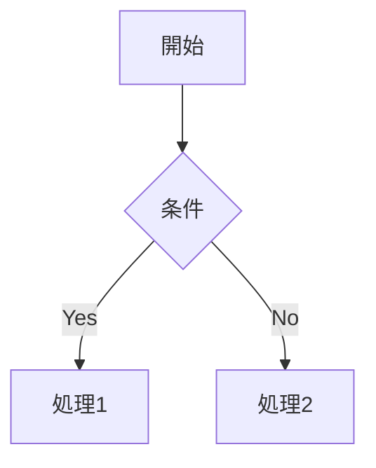

# 汎用ドキュメント フォーマット定義

対象: 他の手順ファイルが担当しない設計ドキュメント全般

## 対象ファイル

ドキュメントルート配下の設計ドキュメントのうち、
専用の手順ファイルを持たないもの（要件定義、認証設計、運用方針、用語外の汎用解説など）。

**他 reference が担当する領域は必ずそちらに委譲する**:
- アーキテクチャ（C4 Context / Container） → `references/architecture.md`
- ER 図・テーブル定義 → `references/database.md`
- 非機能要件 → `references/nfr.md`
- エラーコード一覧 → `references/error-codes.md`

## ファイル冒頭のフロントマター（必須）

全ての汎用ドキュメントに以下のフロントマターを付ける。採番は SKILL.md の「フロントマター採番ルール」に従う。

```markdown
---
sidebar_position: <番号>
title: "<ドキュメントタイトル（日本語）>"
---

# <ドキュメントタイトル>

[以下、本文]
```

## 共通フォーマット原則

### Mermaid 図
````markdown

````

### テーブル
```markdown
| カラム1 | カラム2 | カラム3 |
|---|---|---|
| 値1 | 値2 | 値3 |
```

### エラーコードテーブル
```markdown
| エラーコード | HTTPステータス | 意味 | 発生条件 |
|---|---|---|---|
| `UNAUTHORIZED` | 401 | 認証失敗 | トークン未提示・期限切れ |
```

### データスキーマテーブル
```markdown
| 属性名 | 型 | 説明 | 備考 |
|---|---|---|---|
| `userId` | String (PK) | ユーザーID | UUID形式 |
| `createdAt` | String | 作成日時（ISO8601） | ソートキーとして使用 |
```

### アドモニション（注意書き）

Docusaurus のアドモニション構文で、重要な注意事項や補足を強調できる。

```markdown
:::note
補足情報をここに記載する。
:::

:::warning
注意が必要な事項をここに記載する。
:::

:::danger
危険な操作や禁止事項をここに記載する。
:::
```

## 書き方の指針

- 「設計意図・方針」を書く。実装の詳細はコードに委ねる
- Mermaid図は複雑さを増やさない範囲で使う
- フィールド名・用語はユビキタス言語定義に準拠する
- アーキテクチャ上の重要な決定を記録する場合は `references/adr.md` も参照する
- セキュリティ上の考慮事項や重要な注意点にはアドモニション（`:::warning` 等）を活用する
