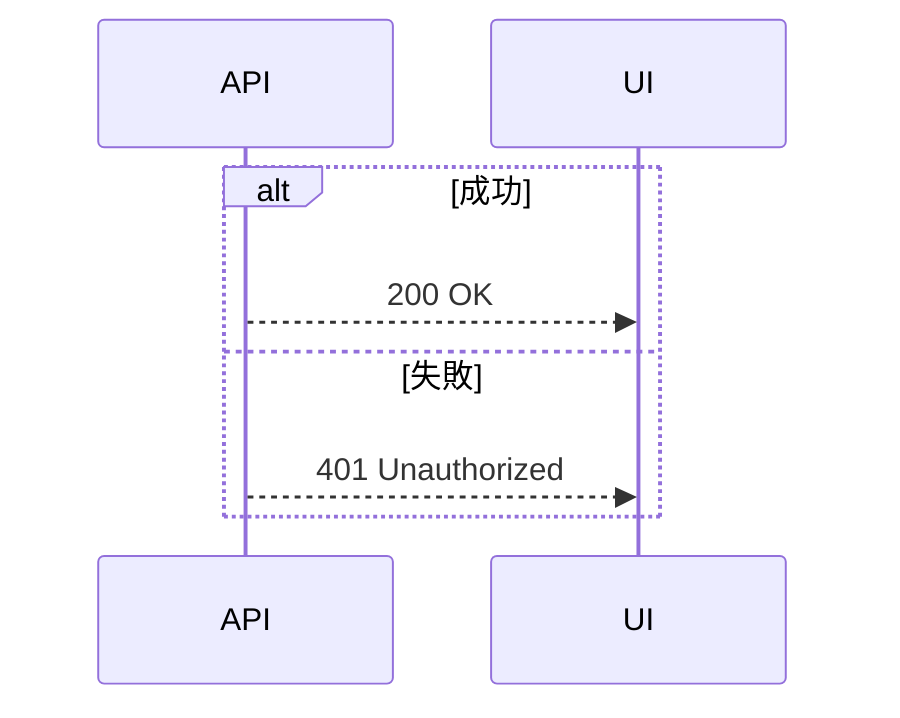
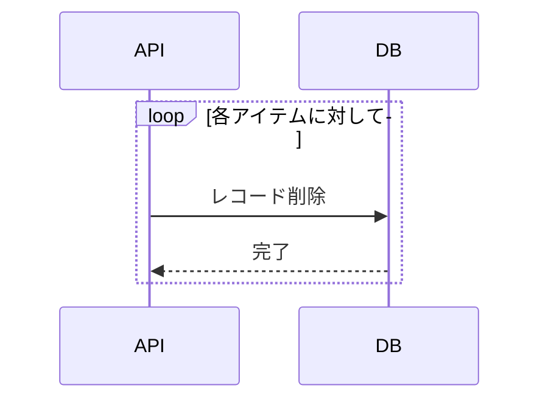

# シーケンス図 フォーマット定義

対象: ドキュメントルート配下の `sequence.md`
- ブートストラップで合意済みの場合はそのパス（既定は `detailed-design/sequence.md`）
- ディレクトリ構成が未確立の場合は、先に `references/bootstrap.md` を実行すること
- OpenAPI 定義が存在しない場合は、シーケンス図を書く前に `references/openapi.md` を先に実行して API 仕様の雛形を作る（シーケンス図のエンドポイント名・フィールド名は OpenAPI に準拠する前提のため）

## セクション構成

シーケンス図ファイルは「フロー単位のセクション」で構成する。
冒頭のフロントマターは必須（採番は SKILL.md「フロントマター採番ルール」に従う）。

```markdown
---
sidebar_position: <番号>
title: "シーケンス図"
---

# シーケンス図

## <フロー名>（例: ユーザー登録フロー）

[フローの概要を1文で説明]

\`\`\`mermaid
sequenceDiagram
  ...
\`\`\`

## <フロー名>（例: ログインフロー）

...
```

## 参加者（participants）の定義

既存のシーケンス図ファイルで使われている参加者を踏襲する。
新規作成時はプロジェクトのアーキテクチャに合わせて定義する。

Mermaid の participant 宣言は以下の形式で記述する：

```mermaid
sequenceDiagram
  participant <identifier> as <display_name>
```

各フローに必要な参加者のみを宣言する（全参加者を毎回宣言しない）。

## 矢印の使い分け

| 記法 | 用途 |
|---|---|
| `->>`  | リクエスト・呼び出し |
| `-->>` | レスポンス・返却 |

既存のシーケンス図に合わせて統一する。

## 制御構文

### 条件分岐（alt/else）



### 繰り返し（loop）



## 書き方の指針

- 処理の「主要な流れ」だけ書く。内部処理の細部は省略する
- 複雑なエラー分岐は別セクションに分ける
- `Note` コメントは補足が必要な場合のみ使う（乱用しない）
- エンドポイント・フィールド名は OpenAPI 仕様に準拠する。OpenAPI が存在しない場合は `references/openapi.md` を先に実行して雛形を作成する

## 視認性ルール（横幅の制御）

### participant数の上限

- **1つの図に含める participant は最大7つまで**
- 上限を超える場合はフェーズごとに図を分割する（サブセクション `###` を使う）

```markdown
## 2. ダウンロードフロー

全体は「認証」→「実行」→「通知」の3フェーズで構成される。

### 2-1. 認証フェーズ
[図: 6 participant]

### 2-2. 実行フェーズ
[図: 5 participant]

### 2-3. 通知フェーズ（非同期）
[図: 4 participant]
```

### ラベルの簡潔化

- 矢印上のメッセージは**意図が伝わる最短の表現**にする
- 実装詳細（アルゴリズム名、内部パラメータ等）は図の外の説明文に書く
- APIパスは必要に応じて短縮する（`POST /api/v1/users/register` → `POST register`）

### Noteの範囲

- `Note over A,Z` のように端から端に広がる Note は幅を強制的に広げるため避ける
- `Note over API` のように関連する participant に絞る
- フェーズの区切りは図の分割（サブセクション）で表現し、Note に頼らない

### 繰り返しパターンの省略

- 認証チェックなど全APIに共通する処理は、セクション冒頭の説明文に記載し、図からは省略してよい
- ただし、**セキュリティ境界の理解に必要な participant は省略しない**
